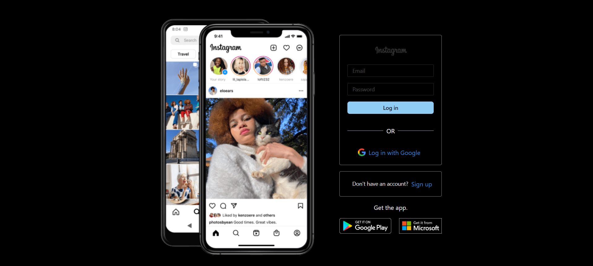
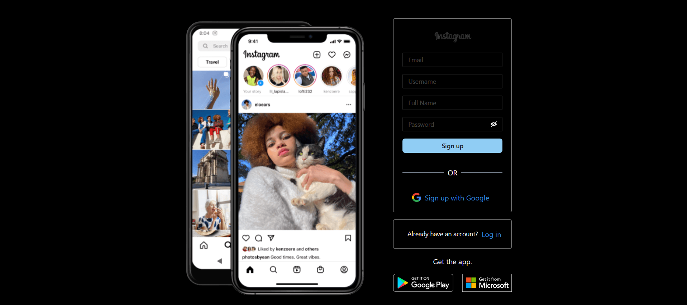
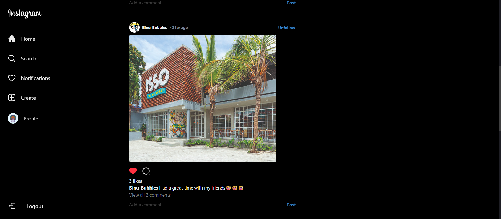
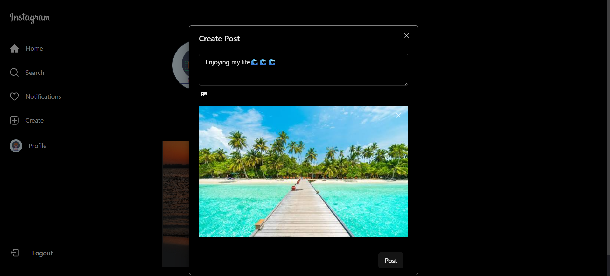
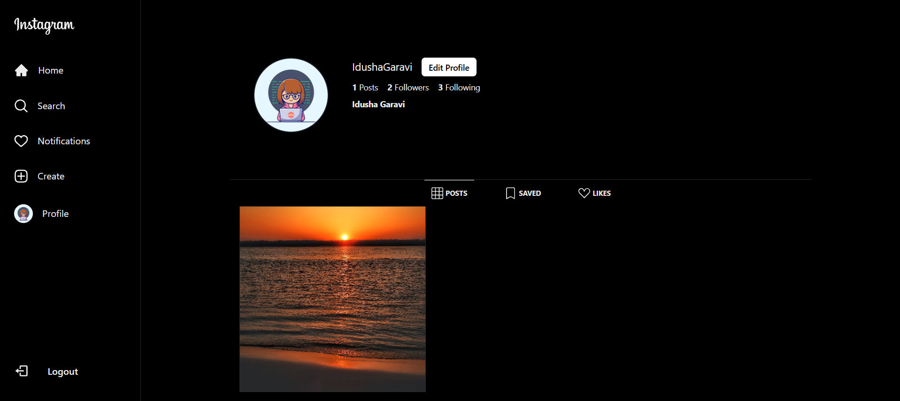
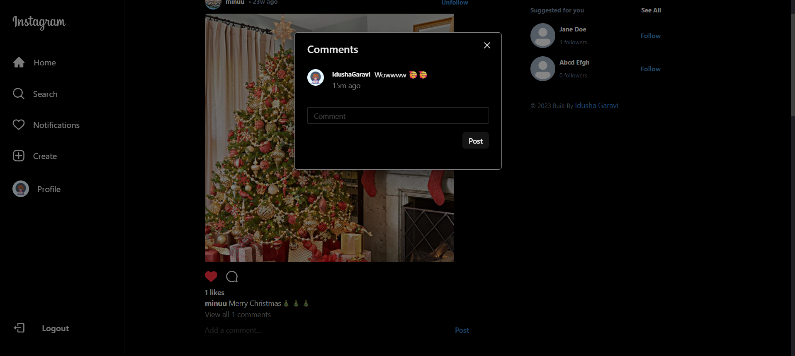
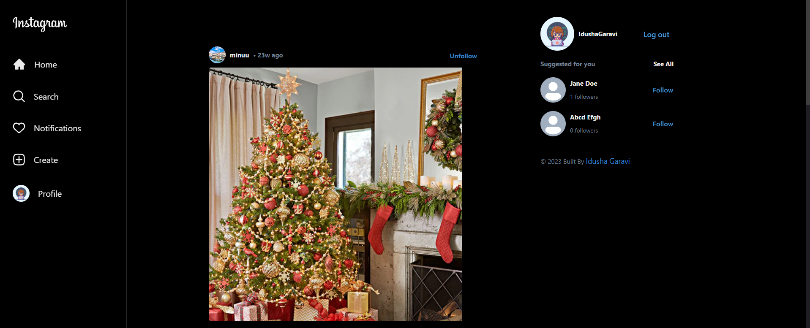
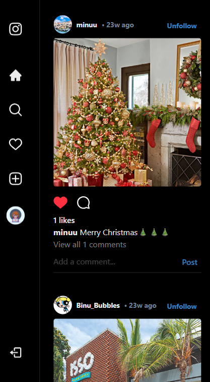

# Social Media Platform

> A modern and responsive social media web application inspired by Instagram, built using React, Firebase, Chakra UI, and Zustand for state management.


---

## Live Demo

🌐 **Live Website**

https://social-media-platform-amber.vercel.app/auth

📂 **GitHub Repository**

https://github.com/IdushaGaravi/Social-Media-Platform

---

## Features at a Glance

- Secure Email & Password Authentication
- Google Sign-In Authentication
- Firebase Authentication Integration
- Cloud Firestore Database
- Firebase Storage for Image Uploads
- Create and Share Posts
- Like and Comment System
- Follow & Unfollow Users
- Suggested Users Feature
- Responsive Instagram-inspired UI
- Protected Routes
- State Management using Zustand
- Modern React Architecture
- Real-Time Firebase Updates
- Fully Responsive Design

---

## Overview

Social Media Platform is a fully functional social media web application that allows users to connect, share content, and interact with others in real time. Inspired by Instagram's user experience, the application provides a modern interface combined with cloud-based backend services powered by Firebase.

The project was developed to strengthen my skills in modern frontend development, cloud integration, state management, and responsive UI design while implementing features commonly found in real-world social media platforms.

This project demonstrates practical experience with:

- React component-based architecture
- Firebase Authentication and Cloud Firestore
- Cloud-based image storage
- State management using Zustand
- Responsive web design principles
- Modern frontend development practices

---

## Tech Stack

| Technology | Version | Purpose |
|------------|---------|---------|
| React | 19.1.0 | Frontend Framework |
| Vite | 7.0.0 | Build Tool |
| Firebase | 12.0.0 | Backend Services |
| Chakra UI | 2.8.2 | UI Component Library |
| Zustand | 5.0.6 | State Management |
| React Router DOM | 7.7.0 | Routing |
| React Firebase Hooks | 5.1.1 | Firebase Integration |
| Framer Motion | 12.23.0 | Animations |
| React Icons | 5.5.0 | Icons Library |

---

## Technologies Used

### Frontend

- React 19
- Vite
- Chakra UI
- React Router DOM
- Framer Motion
- React Icons

### Backend Services

- Firebase Authentication
- Cloud Firestore
- Firebase Storage

### State Management

- Zustand

### Utilities

- React Firebase Hooks

---

## Application Showcase

> Add all screenshots inside the `screenshots` folder.

---

### Authentication System

#### Login Page


```md

```

---

#### Signup Page

```md

```

---

### Home Feed

Browse posts in a responsive Instagram-inspired feed.

```md

```

---

### Create Post

Upload images and share them with captions.

```md

```

---

### User Profile

Manage profile information and view uploaded posts.

```md

```

---

### Comments System

Users can view existing comments and interact with posts through an intuitive comments modal.

```md

```

---

### Suggested Users

Discover and follow other users.

```md

```

---

### Responsive Design

Optimized for desktop and mobile devices.

```md

```

---

## Core Features

### Authentication

- User Registration
- User Login
- Google Sign-In
- Protected Routes

### User Profiles

- Create User Profiles
- Edit Profile Information
- Upload Profile Pictures
- View Other Users' Profiles

### Posts

- Create Posts
- Upload Images
- Add Captions
- View Posts in Feed

### Social Features

- Like Posts
- Comment on Posts
- Follow Users
- Suggested Users
- Search Users

### Responsive Design

- Desktop Friendly
- Mobile Responsive
- Modern UI Components

---

## Project Structure

```text
Social-Media-Platform/
│
├── public/
│
├── screenshots/
│   ├── login-page.png
│   ├── signup-page.png
│   ├── home-feed.png
│   ├── create-post.png
│   ├── profile-page.png
│   ├── comments-modal.png
│   ├── suggested-users.png
│   └── mobile-view.png
│
├── src/
│   ├── components/
│   ├── hooks/
│   ├── pages/
│   ├── firebase/
│   ├── store/
│   ├── utils/
│   └── layouts/
│
├── README.md
├── package.json
├── vite.config.js
└── .env
```

---

## Application Flow

```text
                    User Authentication
                              │
                              ▼
                        Login / Signup
                              │
                              ▼
                           Home Feed
                              │
                              ▼
                      Create & View Posts
                              │
                              ▼
                       Like & Comment Posts
                              │
                              ▼
                         Follow Users
                              │
                              ▼
                       Manage User Profile
                              │
                              ▼
                  Real-Time Firebase Synchronization
```

---

## Installation

### Clone the Repository

```bash
git clone https://github.com/IdushaGaravi/Social-Media-Platform.git

cd Social-Media-Platform
```

---

### Install Dependencies

```bash
npm install
```

---

## Environment Variables

Create a `.env` file in the root directory.

```env
VITE_FIREBASE_API_KEY=

VITE_FIREBASE_AUTH_DOMAIN=

VITE_FIREBASE_PROJECT_ID=

VITE_FIREBASE_STORAGE_BUCKET=

VITE_FIREBASE_MESSAGING_SENDER_ID=

VITE_FIREBASE_APP_ID=

VITE_FIREBASE_MEASUREMENT_ID=
```

You can obtain these values from your Firebase Project Settings.

---

## Running the Project

Start the development server:

```bash
npm run dev
```

The application will run locally at:

```text
http://localhost:5173
```

---

## Production Build

Build the project for production:

```bash
npm run build
```

Preview the production build:

```bash
npm run preview
```

---

## Key Concepts Implemented

- Component-Based Architecture
- Custom React Hooks
- Firebase Authentication
- Cloud Firestore CRUD Operations
- Firebase Storage Integration
- Protected Routes
- State Management using Zustand
- Client-Side Routing
- Responsive Web Design
- Modern React Development Practices
- Cloud-Based Backend Services

---

## What I Learned

This project provided valuable experience in:

- Building scalable React applications.
- Integrating Firebase Authentication and Firestore.
- Managing application state efficiently.
- Implementing cloud-based image storage.
- Designing reusable UI components.
- Developing responsive user interfaces.
- Structuring medium-sized frontend applications.
- Applying modern frontend engineering practices.

---

## Future Improvements

Planned enhancements include:

- Real-Time Notifications
- Direct Messaging System
- Stories Feature
- Video Upload Support
- Infinite Scrolling Feed
- User Activity Tracking
- Dark Mode Support
- CI/CD Pipeline Integration
- Cloud Deployment Automation
- Progressive Web App (PWA) Support

---

## Author

### Garavi W. A. I.

- Undergraduate Software Engineering Student
- Full-Stack Web Development Enthusiast
- Passionate about Cloud Technologies and Modern Web Applications

---

## License

This project is intended for educational and portfolio purposes.

Feel free to fork the repository and explore the implementation.

---

## Support

If you found this project useful, consider giving it a ⭐ on GitHub.

GitHub Repository:

https://github.com/IdushaGaravi/Social-Media-Platform